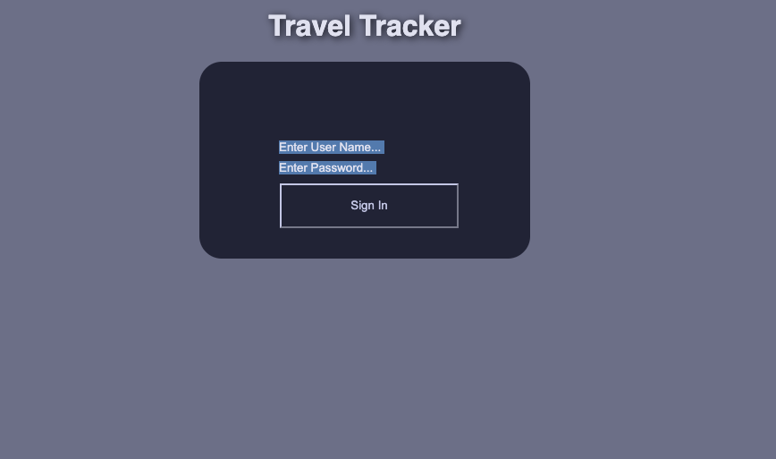
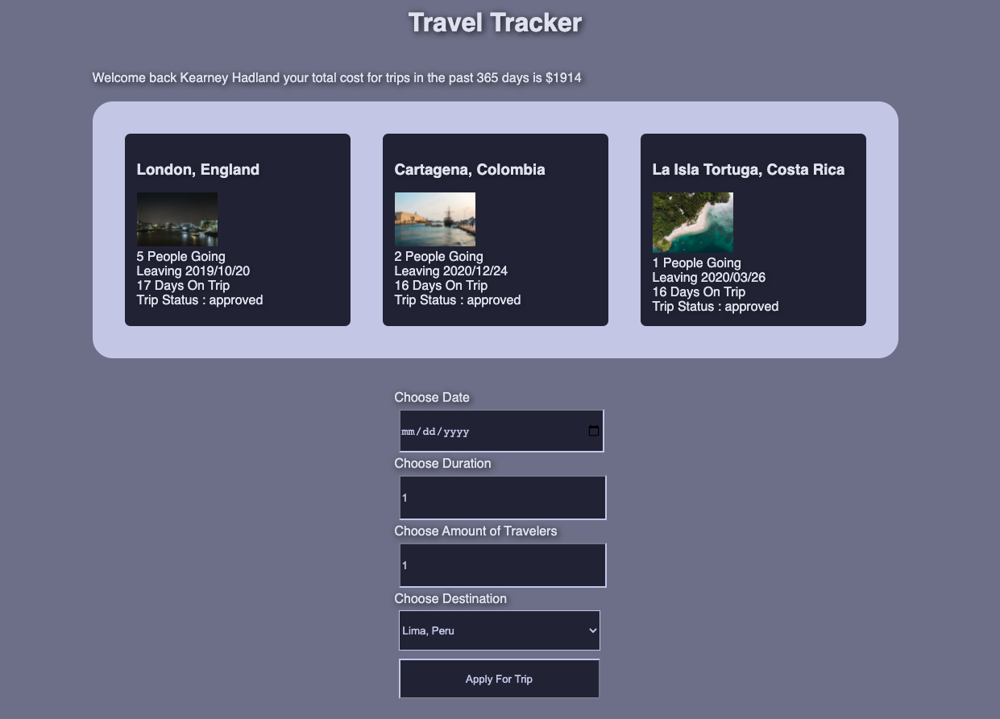
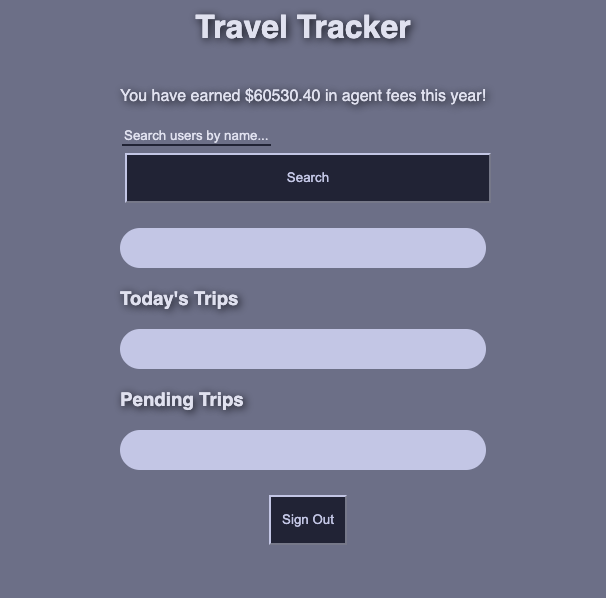

# Title:

A [Front-End Project] by [Robert DeRouin](https://github.com/robertjosephderouin)

* Project Manager: [Travis Rollins](https://github.com/Kalikoze)

1. [Overview](#overview)
2. [Functionality](#functionality)
3. [Iterations](#iterations)
4. [Technologies](#technologies)
5. [Contributors](#contributors)
6. [Resources](#resources)

## Overview

The travel tracker allows users to login as either a traveler or an agent.  As a traveler they can look at all the trips they have been on and create new trips.  The agent can delete traveler trips, approve them, or search specific travelers.

## Login

## Traveler

## Agent

## Functionality

* Current:
  * User can navigate between three views. "Login", "Traveler", and "Agent".
  * Users can login in as either a traveler(1-50) or as the agency.
  * Users as the traveler can make trip requests by filling out a form at the bottom of the Traveler screen.
  * Users as the agent can approve requests made by travelers, search for specific travelers and delete trips made by travelers.
  * Extension - Utilized date fns to make working with dates easier. 

## Technologies

1. HTML
2. CSS
3. JavaScript
4. GitHub (website hosting and source code management)
5. Webpack
6. Sassy CSS
7. Date FNS

## Contributors

* Creator: [Robert DeRouin](https://github.com/robertjosephderouin)
* Project Manager: [Travis Rollins](https://github.com/Kalikoze)

## Resources

* Project Repo : https://github.com/robertjosephderouin/traveltracker

* Project Description : https://frontend.turing.edu/projects/travel-tracker.html

* Original Github Repo : https://github.com/turingschool-examples/webpack-starter-kit

* Local Server : https://github.com/turingschool-examples/travel-tracker-api

* Third Party Attribution : https://www.npmjs.com/package/date-fns
